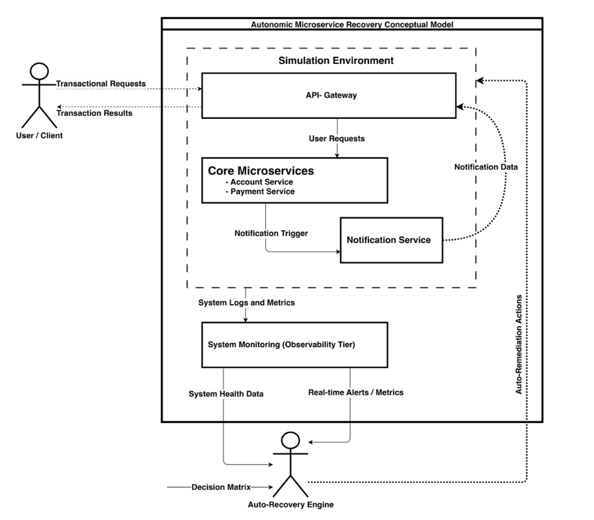

# 🛡️ Auto Recovery Engine (ARE)

[](https://adoptium.net/)
[](https://spring.io/projects/spring-boot)
[](https://www.docker.com/)
[](https://grafana.com/)
[](https://www.rabbitmq.com/)

An advanced, event-driven, self-healing microservice ecosystem simulating a resilient financial transaction platform. The **Auto Recovery Engine (ARE)** provides built-in fault-injection capabilities to test and observe real-time automated recovery actions. It integrates a full observability stack (Prometheus, Loki, Alertmanager, and Grafana) with a closed-loop remediation handler that detects service anomalies and triggers automated healing runs.

---

## 🗺️ Architectural Topology

The system implements an autonomic closed-loop feedback design for microservice self-healing, consisting of two primary cycles:
1. **The Request & Notification Loop**: Clients interact via the API Gateway with core services (Account and Payment), which fire asynchronous job triggers to the Notification Service.
2. **The Observability & Remediation Loop**: Container logs and metrics flow into the System Monitoring (Observability Tier), which routes alerts to the Auto-Recovery Engine. The engine evaluates its decision matrix and triggers automated remediation actions back on the environment.



---

## 📂 Project Structure

```
auto-recovery-engine-pgd/
├── pom.xml                          # Parent POM (Dependency management)
├── Makefile                         # Developer workflow shorthand
├── docker-compose.yml               # Postgres, RabbitMQ, Observability, and Microservices
├── auto_recovery_engine.dbml        # Conceptual DB schema definition
├── config/                          # Configuration files for infrastructure
│   ├── prometheus.yml               # Scrape configurations
│   ├── prometheus/alert-rules.yml   # Threshold rules (ServiceDown, HighErrorRate, etc.)
│   ├── loki/loki-config.yml         # Log storage config
│   ├── promtail/promtail-config.yml # Docker log shipping config
│   ├── grafana/                     # Provisioned datasources and dashboards
│   └── alertmanager/                # Alerts routing to the Recovery Engine webhook
│
├── services/                        # Java Microservices
│   ├── common-core/                 # Shared JPA entities, DTOs, and Liquibase migrations
│   ├── api-gateway/                 # Gateway router (Spring Cloud Gateway, JWT filter, CB)
│   ├── account-service/             # User and ledger account management
│   ├── payment-service/             # Payment processing (WebClient, R4J Circuit Breaker)
│   ├── notification-worker/         # Event consumer (RabbitMQ to Mock Mail Sender)
│   ├── spring-boot-admin/           # Spring Boot Admin (Service registration and runtime details)
│   └── recovery-engine/             # Alert receiver, cooling rules, and execution handler
│
└── scripts/                         # Testing & experiment orchestration
    ├── launch_system.sh             # Master script to build & run all tiers
    ├── test-observability.sh        # Seeds auth flow, generates metrics, tests restart
    ├── simulate_load.py             # Generates live user traffic / database writes
    └── run_experiments.py           # Injects faults, records recovery MTTR, plots graph
```

---

## 🗄️ Database Design & Schema

The ecosystem uses a **Shared Database Pattern** for simplicity. Services connect to PostgreSQL (`are_db`). DB migrations are managed centrally by **Liquibase** located in `common-core` to guarantee schema consistency.

Below is the relationship ERD (represented in DBML notation):

*   **`users`**: Master customer logins and profiles.
*   **`accounts`**: Financial ledger accounts (optimistic locking enabled via a `@Version` field to prevent race conditions).
*   **`transactions`**: Immutable transaction audit logs linked directly to an account.
*   **`payments`**: Decoupled transfers managed by the Payment Service, using logical account references instead of physical DB foreign keys to maintain modular boundaries.
*   **`otps`**: Temporary security codes used during onboarding registration steps.

```
┌──────────────┐          ┌──────────────┐          ┌─────────────────┐
│    users     │          │   accounts   │          │  transactions   │
├──────────────┤          ├──────────────┤          ├─────────────────┤
│ id (PK)      │◄───┐     │ id (PK)      │◄───┐     │ id (PK)         │
│ email (UQ)   │    └────  userId (FK)   │    └────  accountId (FK)  │
│ phoneNumber  │          │ accountNo(UQ)│          │ userId (FK) ────┼──┐
│ passwordHash │          │ balance      │          │ amount          │  │
│ status       │          │ status       │          │ type (cr/dr)    │  │
│ type (role)  │          │ version      │          │ correlationId   │  │
└──────────────┘          └──────────────┘          └─────────────────┘  │
       ▲                                                                 │
       │                                                                 │
       │                                                                 │
       │                  ┌──────────────┐                               │
       │                  │     otps     │                               │
       │                  ├──────────────┤                               │
       └─────────────────  userId (FK)   │                               │
                          │ otp          │                               │
                          │ expiresAt    │                               │
                          │ usedAt       │                               │
                          └──────────────┘                               │
                                                                         │
                          ┌──────────────┐                               │
                          │   payments   │                               │
                          ├──────────────┤                               │
                          │ id (PK)      │                               │
                          │ fromAccId ◄──┼───────────────────────────────┘
                          │ toAccId      │  (Cross-Service Logical Ref,
                          │ amount       │   No Database FK constraints)
                          │ status       │
                          │ failureReason│
                          └──────────────┘
```

---

## 🛠️ Microservice Breakdown

| Service | Port | Primary Responsibilities | Core Stack Components |
|---|---|---|---|
| **API Gateway** | `8080` | JWT validation, client routing, correlation ID injection | WebFlux, Spring Cloud Gateway, JJWT |
| **Account Service** | `8082` | Signups, OTPs, balance ledgers, transaction histories | WebMVC, JPA, HikariCP, PostgreSQL, RabbitMQ |
| **Payment Service** | `8081` | Safe debits, credits, refunds, and inter-service client logic | WebMVC, WebClient, Resilience4j Circuit Breaker |
| **Notification Worker** | `8085` | Consuming MQ notification jobs, rendering HTML emails | RabbitMQ AMQP, JavaMailSender, Thymeleaf |
| **Spring Boot Admin** | `8086` | Health registration, dynamic metrics UI, thread states | Spring Boot Admin Server |
| **Recovery Engine** | `8087` | Alert webhook receiver, cooldown manager, action executor | Spring Boot, Webhook Parser, Audit Logging |

---

## ⚡ Fault Injection System

Each business service mounts a `FaultSimulationController` that is intercepted by a custom `FaultInterceptor` filter. This allows developers to test recovery scenarios by sending REST calls to the gateway.

### Fault Endpoints

| Endpoint (POST) | JSON Payload | Simulated Behavior |
|---|---|---|
| `/fault/{service}/unresponsive` | `{"enable": true}` | Intercepts business requests and sleeps for 60s (induces Gateway/Client timeouts). |
| `/fault/{service}/error-rate` | `{"rate": 50}` | Randomly drops `rate`% of inbound business requests, returning an HTTP 500 error wrapper. |
| `/fault/{service}/memory-leak` | `{"enable": true}` | Launches a virtual thread allocating `1MB` byte arrays every 500ms (OOM testing). |
| `/fault/{service}/cpu-spike` | `{"enable": true}` | Spawns background virtual threads running busy loops on all available cores. |
| `/fault/{service}/crash` | *None* | Invokes a JVM shutdown (`System.exit(1)`). |

> [!NOTE]
> Paths matching `/fault/**`, `/actuator/**`, `/internal/**`, `/swagger-ui/**`, and `/v3/api-docs/**` bypass the fault interceptor so that infrastructure control planes remain operational during outages.

---

## 🧠 The Self-Healing Matrix

The **Recovery Engine** parses Alertmanager webhook payloads, checks the target service status, respects a configurable cooldown timer, and runs actions mapped in its active matrix rules:

```yaml
# Matrix Rule Mapping inside recovery-engine application.yml
recovery:
  matrix:
    - fault: Service Crash
      signal: HTTP 5xx rate spike (ServiceDown alert)
      primary-action: RESTART
      threshold: 1
      window: 30s
    - fault: High Error Rate
      signal: HTTP 5xx rate > 10% (HighErrorRate alert)
      primary-action: CIRCUIT_BREAKER_OPEN
      secondary-action: REROUTE_TRAFFIC
      threshold: 0.1
      window: 120s
    - fault: Response Time Degradation
      signal: p95 latency > 2s (HighLatency alert)
      primary-action: CIRCUIT_BREAKER_HALF_OPEN
      threshold: 2000
      window: 180s
    - fault: Connection Pool Exhaustion
      signal: HikariCP pending threads (DbConnectionTimeout alert)
      primary-action: POOL_RESET
      threshold: 5
      window: 60s
    - fault: Cascading Failure
      signal: Multi-service alarms firing
      primary-action: CASCADING_RECOVERY
      threshold: 2
      window: 60s
```

---

## 🚀 Quick Start Guide

### Prerequisites
*   Docker & Docker Compose (v2+)
*   Java Development Kit (JDK 21+)
*   Maven 3.8+ (or use the provided `./mvnw` wrapper)

### Step 1: Clone the Repo and Build Binary Jars
Compile all microservices and package them into target jars:
```bash
make build
```

### Step 2: Start the System
You can start all infrastructure, observability stacks, and microservice containers using the launch utility:
```bash
make launch
# This runs docker-compose for DB, MQ, and Observability,
# and starts the Spring Boot services in new terminal windows.
```

If you prefer to start individual components manually:
*   Start infrastructure only: `make infra-compose-up`
*   Start the gateway locally: `make start-gateway`
*   Start the account service locally: `make start-account`
*   Start the payment service locally: `make start-payment`
*   Start the notification worker: `make start-notif`
*   Start the recovery engine: `make start-recovery`

---

## 🧪 Simulation, Load & Experiment Scripts

The repository contains scripts under `scripts/` to automate load testing and measure self-healing recovery times.

### 1. Master Test Orchestration
To perform a complete integration run that verifies database connectivity, triggers background traffic, injects a container crash, and measures the recovery loop:
```bash
chmod +x scripts/run_all_tests.sh
./scripts/run_all_tests.sh
```

### 2. Auto-Seeding & Observability Verification (`scripts/test-observability.sh`)
This script checks infrastructure health, hooks into the API Gateway auth flow, and:
1.  **Registers a User** via `POST /api/accounts/auth/signup`
2.  **Verifies OTP** using the development master code `123456`
3.  **Sets a password** using `POST /api/accounts/auth/create-password` to activate the user account
4.  **Generates HTTP 4xx/5xx logs** to populate Loki and Prometheus
5.  **Crashes the account service** to confirm the recovery engine's automated restart hook.

### 3. Background Load Simulation (`scripts/simulate_load.py`)
Spawns active clients making transactions in the background to mimic standard production traffic:
```bash
python scripts/simulate_load.py
```

### 4. Resilience Experiments & MTTR Plots (`scripts/run_experiments.py`)
Injects structured faults (Service Crash, High Error Rate, Latency Spike, CPU Spike, Memory Leak) and polls the Recovery Engine logs to determine the exact **Mean Time to Recovery (MTTR)**.
*   Results are written to `phase4_results.json`.
*   A comparative performance chart is generated and saved as `phase4_mttr_results.png`.

---

## 📊 Observability Port Map & UIs

During runtime, you can inspect the health and telemetry details of all microservices:

*   **API Gateway entrypoint**: [http://localhost:8080](http://localhost:8080)
*   **Spring Boot Admin console**: [http://localhost:8086](http://localhost:8086) (view service nodes and trigger thread dumps)
*   **Prometheus metrics console**: [http://localhost:9090](http://localhost:9090)
*   **Grafana dashboards**: [http://localhost:3000](http://localhost:3000) (Default login: `admin / admin`)
    *   *Path: Dashboards -> ARE - Microservices Overview*
*   **Alertmanager console**: [http://localhost:9093](http://localhost:9093)
*   **RabbitMQ administration UI**: [http://localhost:15672](http://localhost:15672) (Default login: `guest / guest`)

---

## ⚠️ Known Specification Gaps & Architectural Insights (So Far)

Below are known implementation details and deviations from the initial specification for reference when contributing:

1.  **Shared Database**: Services share a PostgreSQL instance (`are_db`) and database schemas. In production, this would be isolated, but it is kept shared here to simplify local deployments.
2.  **Entity ID Formats**: The core specification requested UUIDs for primary keys. The database schema currently implements `bigint` (auto-increment) keys for simplicity.
3.  **BaseEntity Deletions**: The soft-delete timestamp column `deleted_at` is marked `NOT NULL` in the base DDL but initialized as null, which may require soft deletes to handle default values explicitly.
4.  **Notification MDC Tracing**: The `notification-worker` consumes events from RabbitMQ queues, but does not extract the `X-Correlation-ID` header into its thread-local logging MDC.
5.  **Gateway Auth Mocking**: Authentication tokens are issued directly by the Gateway (`api-gateway`) rather than the Account Service to simplify token routing.
