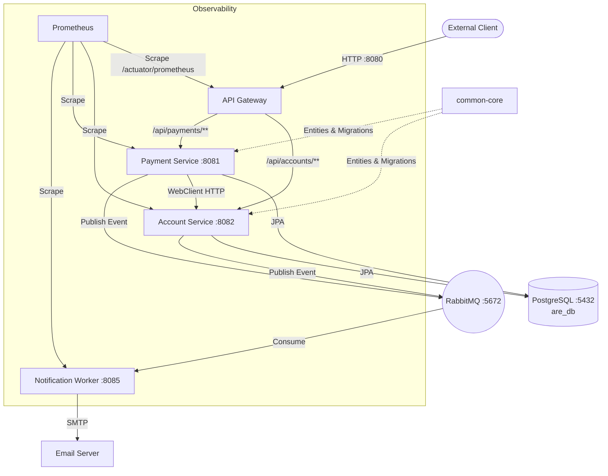

# Auto Recovery Engine (ARE) — Comprehensive Project Document

> **Purpose**: This document provides a complete, source-level understanding of the ARE project's current state. It is designed so that an AI (or developer) can read it and immediately contribute meaningful code without needing to explore the filesystem.

---

## 1. Executive Summary

The **Auto Recovery Engine (ARE)** is a Java 21 / Spring Boot 3.5.13 multi-module Maven project that simulates a financial microservices ecosystem. It provides **fault injection endpoints** on every business service, enabling a future "recovery engine" module to detect, diagnose, and automatically remediate failures. The system handles user onboarding, account management, payment processing, and event-driven notifications.

---

## 2. Architecture Diagram



---

## 3. Technology Stack (Exact Versions)

| Layer | Technology | Version |
|---|---|---|
| Language | Java (Temurin JDK) | 21 (Docker: 25) |
| Framework | Spring Boot | 3.5.13 |
| Gateway | Spring Cloud Gateway (WebFlux) | 2025.0.2 (Spring Cloud BOM) |
| ORM | Spring Data JPA / Hibernate | Managed by Spring Boot |
| Database | PostgreSQL | 17 |
| Migrations | Liquibase | 4.31.1 (Maven plugin) |
| Messaging | RabbitMQ | 4.x (management image) |
| Resilience | Resilience4j | 2.2.0 |
| Auth | JJWT | 0.12.6 |
| API Docs | springdoc-openapi | 2.8.5 |
| Metrics | Micrometer + Prometheus registry | Managed by Spring Boot |
| Logging | Logstash Logback Encoder | 8.0 |
| Admin | Spring Boot Admin Client | 3.5.8 |
| Build | Maven (multi-module) | Wrapper included |
| Containers | Docker multi-stage (Temurin) | Compose v2 |

---

## 4. Project Structure (File-Level)

```
auto-recovery-engine-pgd/
├── pom.xml                          # Parent POM — defines all modules + shared deps
├── .env                             # DATABASE_URL, DATABASE_USER, DATABASE_PASSWORD, MAIL_*
├── Makefile                         # Developer workflow shortcuts
├── docker-compose.yml               # Postgres, RabbitMQ, all 4 services
├── mvnw / mvnw.cmd / .mvn/         # Maven wrapper
│
└── services/
    ├── common-core/                 # Shared library (NOT a runnable service)
    │   ├── pom.xml
    │   └── src/main/
    │       ├── java/com/are/common/
    │       │   ├── config/
    │       │   │   └── OpenApiConfig.java
    │       │   └── model/
    │       │       ├── BaseEntity.java
    │       │       ├── UserEntity.java
    │       │       ├── AccountEntity.java
    │       │       ├── PaymentEntity.java
    │       │       ├── TransactionEntity.java
    │       │       ├── OTPEntity.java
    │       │       ├── UserStatus.java          # ACTIVE, INACTIVE, BLACKLISTED
    │       │       ├── UserType.java            # CUSTOMER, ADMIN
    │       │       ├── AccountStatus.java       # INACTIVE, ACTIVE, SUSPENDED, CLOSED
    │       │       ├── PaymentStatus.java       # PENDING, PROCESSING, COMPLETED, FAILED, REFUNDED
    │       │       ├── TransactionStatus.java   # success, failed, pending, reversed
    │       │       ├── TransactionEntry.java    # credit, debit
    │       │       ├── OTPRecipient.java         # EMAIL, PHONE
    │       │       └── OTPType.java             # ONBOARD, PASSWORD_RESET, PIN_RESET, etc.
    │       └── resources/db/changelog/
    │           ├── db.changelog-master.yaml      # includeAll: migrations/
    │           └── migrations/
    │               └── 20260410_084044_changelog.postgresql.yaml
    │
    ├── api-gateway/
    │   ├── pom.xml
    │   ├── Dockerfile
    │   └── src/main/
    │       ├── java/com/are/gateway/
    │       │   ├── ApiGatewayApplication.java
    │       │   ├── config/
    │       │   │   ├── SecurityConfig.java       # JWT SecretKey bean
    │       │   │   ├── ResilienceConfig.java     # Default circuit breaker config
    │       │   │   └── RoutingConfig.java        # Java-based route definitions
    │       │   ├── controller/
    │       │   │   ├── AuthController.java       # POST /auth/token
    │       │   │   └── FaultSimulationController.java
    │       │   ├── filter/
    │       │   │   ├── JwtAuthFilter.java        # GlobalFilter — JWT validation
    │       │   │   └── CorrelationIdFilter.java  # GlobalFilter — X-Correlation-ID
    │       │   └── health/
    │       │       └── HealthIndicatorConfig.java # Custom DB + RabbitMQ health checks
    │       └── resources/
    │           ├── application.yml
    │           ├── application-docker.yml
    │           └── logback-spring.xml
    │
    ├── account-service/
    │   ├── pom.xml
    │   ├── Dockerfile
    │   └── src/main/
    │       ├── java/com/are/account/
    │       │   ├── AccountServiceApplication.java  # @EnableAsync, @EntityScan
    │       │   ├── config/
    │       │   │   └── RabbitConfig.java
    │       │   ├── controller/
    │       │   │   ├── UserController.java
    │       │   │   ├── AccountController.java
    │       │   │   ├── TransactionController.java
    │       │   │   └── FaultSimulationController.java
    │       │   ├── dto/
    │       │   │   ├── UserRegistrationRequest.java   # record
    │       │   │   ├── VerifyOnboardOtpRequest.java   # record
    │       │   │   ├── UserResponse.java              # record
    │       │   │   ├── CreateAccountRequest.java      # record
    │       │   │   ├── BalanceUpdateRequest.java       # record
    │       │   │   └── AccountResponse.java           # record
    │       │   ├── filter/
    │       │   │   └── CorrelationIdFilter.java       # Servlet Filter
    │       │   ├── repository/
    │       │   │   ├── UserRepository.java
    │       │   │   ├── AccountRepository.java
    │       │   │   ├── TransactionRepository.java
    │       │   │   └── OTPRepository.java
    │       │   └── service/
    │       │       ├── UserService.java
    │       │       ├── AccountService.java
    │       │       ├── TransactionService.java
    │       │       └── OnboardingWorkerService.java
    │       └── resources/
    │           ├── application.yml
    │           ├── application-docker.yml
    │           └── logback-spring.xml
    │
    ├── payment-service/
    │   ├── pom.xml
    │   ├── Dockerfile
    │   └── src/main/
    │       ├── java/com/are/payment/
    │       │   ├── PaymentServiceApplication.java  # @EntityScan
    │       │   ├── config/
    │       │   │   ├── RabbitConfig.java
    │       │   │   └── WebClientConfig.java        # WebClient for account-service
    │       │   ├── controller/
    │       │   │   ├── PaymentController.java
    │       │   │   └── FaultSimulationController.java
    │       │   ├── dto/
    │       │   │   ├── PaymentRequest.java   # record
    │       │   │   └── PaymentResponse.java  # record
    │       │   ├── filter/
    │       │   │   └── CorrelationIdFilter.java  # Servlet Filter
    │       │   ├── repository/
    │       │   │   └── PaymentRepository.java
    │       │   └── service/
    │       │       └── PaymentService.java
    │       └── resources/
    │           ├── application.yml
    │           ├── application-docker.yml
    │           └── logback-spring.xml
    │
    ├── notification-worker/
    │   ├── pom.xml
    │   ├── Dockerfile
    │   └── src/main/
    │       ├── java/com/are/notification/
    │       │   ├── NotificationWorkerApplication.java
    │       │   ├── config/
    │       │   │   └── RabbitConfig.java
    │       │   ├── controller/
    │       │   │   └── FaultSimulationController.java
    │       │   ├── listener/
    │       │   │   └── PaymentNotificationListener.java  # @RabbitListener
    │       │   └── service/
    │       │       └── NotificationService.java          # JavaMailSender
    │       └── resources/
    │           ├── application.yml
    │           ├── application-docker.yml
    │           └── logback-spring.xml
    │
    └── recovery-engine/             # EMPTY — placeholder for future module
```

---

## 5. Data Model (common-core Entities — Source of Truth)

### 5.1 BaseEntity (`@MappedSuperclass`)
All entities extend this. It provides:
- `id` — `Long`, auto-generated (`GenerationType.IDENTITY`)
- `createdAt` — `LocalDateTime`, `@CreationTimestamp`, non-updatable
- `updatedAt` — `LocalDateTime`, `@UpdateTimestamp`
- `deleted` — `Boolean`, default `false` (soft delete flag)
- `deletedAt` — `LocalDateTime` (nullable in practice, but column declared `NOT NULL` — **known inconsistency**)
- Helper methods: `markAsDeleted()`, `restore()`

> [!IMPORTANT]
> The spec says entities should use UUID for IDs. The current implementation uses **Long (auto-increment)**. This is a deviation from the specification.

### 5.2 UserEntity (table: `users`)
| Field | Type | Constraints |
|---|---|---|
| firstName | String | NOT NULL |
| lastName | String | NOT NULL |
| email | String | UNIQUE, NOT NULL |
| phoneNumber | String(20) | Nullable |
| status | UserStatus (enum) | NOT NULL, default INACTIVE |
| password | String | Nullable (set during onboarding) |
| type | UserType (enum) | NOT NULL, default CUSTOMER |

- **Note**: The spec calls this field `passwordHash` and `role`; the code uses `password` and `type`.

### 5.3 AccountEntity (table: `accounts`)
| Field | Type | Constraints |
|---|---|---|
| user | UserEntity (FK) | `@ManyToOne(LAZY)`, NOT NULL |
| accountNumber | String(20) | UNIQUE, NOT NULL |
| accountName | String(100) | NOT NULL |
| balance | BigDecimal(19,4) | NOT NULL, default 0 |
| currency | String(3) | NOT NULL, default "NGN" |
| status | AccountStatus (enum) | NOT NULL |
| version | Long | `@Version` — optimistic locking |

### 5.4 PaymentEntity (table: `payments`)
| Field | Type | Constraints |
|---|---|---|
| fromAccountId | Long | NOT NULL |
| toAccountId | Long | NOT NULL |
| amount | BigDecimal(19,4) | NOT NULL |
| currency | String(3) | NOT NULL |
| status | PaymentStatus (enum) | NOT NULL |
| description | String(500) | Nullable |
| reference | String(100) | NOT NULL |
| correlationId | String(50) | Nullable |
| failureReason | String(500) | Nullable |

- **Note**: The spec says `sourceAccount (FK)` and `destinationAccountNumber`. The code uses raw `Long` IDs (not FK relations), which is a deliberate design choice for loose coupling between payment-service and account-service databases.

### 5.5 TransactionEntity (table: `transactions`)
| Field | Type | Constraints |
|---|---|---|
| account | AccountEntity (FK) | `@ManyToOne(LAZY)`, NOT NULL |
| user | UserEntity (FK) | `@ManyToOne(LAZY)`, NOT NULL |
| type | TransactionEntry (enum) | NOT NULL (credit/debit) |
| status | TransactionStatus (enum) | NOT NULL, default pending |
| amount | BigDecimal(19,4) | NOT NULL, `@DecimalMin("0.0")` |
| balanceBefore | BigDecimal(19,4) | Nullable |
| balanceAfter | BigDecimal(19,4) | Nullable |
| reference | String(100) | NOT NULL |
| description | String(500) | Nullable |
| correlationId | String(50) | NOT NULL |

### 5.6 OTPEntity (table: `otps`)
| Field | Type | Constraints |
|---|---|---|
| user | UserEntity (FK) | `@ManyToOne(LAZY)`, NOT NULL |
| otp | String | NOT NULL |
| recipient | OTPRecipient (enum) | NOT NULL (EMAIL/PHONE) |
| type | OTPType (enum) | NOT NULL |
| usedAt | LocalDateTime | Nullable (null = unused) |
| expiresAt | LocalDateTime | NOT NULL |

### 5.7 Enum Values Reference

| Enum | Values |
|---|---|
| UserStatus | `ACTIVE`, `INACTIVE`, `BLACKLISTED` |
| UserType | `CUSTOMER`, `ADMIN` |
| AccountStatus | `INACTIVE`, `ACTIVE`, `SUSPENDED`, `CLOSED` |
| PaymentStatus | `PENDING`, `PROCESSING`, `COMPLETED`, `FAILED`, `REFUNDED` |
| TransactionStatus | `success`, `failed`, `pending`, `reversed` (lowercase!) |
| TransactionEntry | `credit`, `debit` (lowercase!) |
| OTPRecipient | `EMAIL`, `PHONE` |
| OTPType | `ONBOARD`, `PASSWORD_RESET`, `PIN_RESET`, `EMAIL_VERIFICATION`, `PHONE_VERIFICATION`, `TWO_FACTOR_AUTH` |

---

## 6. Service-by-Service Feature Breakdown

### 6.1 API Gateway (port 8080)

**Package**: `com.are.gateway`

#### Authentication Flow
1. `AuthController` at `POST /auth/token` accepts `{ "username": "..." }` and issues a JWT signed with HMAC-SHA256.
2. Token payload: `sub` (username), `iat`, `exp` (1 hour). **Not yet**: `email`, `role`.
3. `JwtAuthFilter` (GlobalFilter, order -100) validates the `Authorization: Bearer <token>` header on all non-public paths.
4. On success, adds `X-User-Id` header (from `claims.getSubject()`) to the forwarded request. **Not yet**: `X-User-Role`.
5. Public paths (no auth): `/auth/token`, `/actuator/**`, `/v3/api-docs/**`, `/swagger-ui/**`, `/webjars/**`.

> [!WARNING]
> The spec says `/api/accounts/auth/**` and `/internal/**` should be public. Current code uses `/auth/token` directly on the gateway.  
> The spec says the gateway should add `X-User-Role`. Currently it only adds `X-User-Id`.  
> The spec says tokens are issued by **account-service**. Currently the `AuthController` lives on the **api-gateway**.

#### Routing (RoutingConfig.java — local profile)
| Route ID | Path Pattern | Target | Filter |
|---|---|---|---|
| payment-route | `/api/payments/**` | `http://localhost:8081` | StripPrefix=1 |
| account-route | `/api/accounts/**` | `http://localhost:8082` | StripPrefix=1 |
| notification-route | `/api/notifications/**` | `http://localhost:8082` | StripPrefix=1 |
| *-swagger-ui | `/swagger-ui/{service}/**` | Respective service | RewritePath |

#### Routing (application-docker.yml)
Routes override to use Docker service names: `http://payment-service:8081`, `http://account-service:8082`.

#### Resilience
- **ResilienceConfig.java**: Default Resilience4j circuit breaker — sliding window 10, 50% failure threshold, 30s open state, 3 half-open calls, 5s timeout.
- **application.yml**: Default CircuitBreaker filter configured in gateway cloud config.

#### Health Checks
- `HealthIndicatorConfig` provides custom `db` and `rabbit` health indicators. The gateway connects to Postgres (via `spring-boot-starter-jdbc`) and RabbitMQ to check infrastructure health.

#### Correlation ID
- `CorrelationIdFilter` (GlobalFilter, order -200 — runs before JWT): reads or generates `X-Correlation-ID`, forwards to downstream in request headers and echoes in response headers. **Note: does NOT use MDC** (WebFlux-based, so MDC is not used thread-locally).

---

### 6.2 Account Service (port 8082)

**Package**: `com.are.account`  
**Application class**: `@SpringBootApplication`, `@EnableAsync`, `@EntityScan({"com.are.account", "com.are.common.model"})`

#### API Endpoints

**UserController** (`/users`):
| Method | Path | Description | Auth Required |
|---|---|---|---|
| POST | `/users/signup` | Register new user (creates inactive account + OTP) | Currently: no filter |
| POST | `/users/create-password` | Verify OTP + set password (completes onboarding) | Currently: no filter |

**AccountController** (`/accounts`):
| Method | Path | Description |
|---|---|---|
| POST | `/accounts` | Create a new account |
| GET | `/accounts/{id}` | Get account by ID |
| GET | `/accounts` | List accounts (optional `?status=` filter, pagination) |
| PUT | `/accounts/{id}` | Update account details |
| DELETE | `/accounts/{id}` | Soft-close account (sets status to CLOSED) |
| PUT | `/accounts/{id}/balance` | Credit or debit balance + record transaction |

**TransactionController** (`/accounts/{accountId}/transactions`):
| Method | Path | Description |
|---|---|---|
| GET | `/accounts/{accountId}/transactions` | List transactions (optional date range, pagination) |
| GET | `/accounts/{accountId}/transactions/summary` | Aggregated credit/debit counts and amounts |

#### Business Logic Details

**User Registration Flow** (`UserService.registerUser`):
1. Check email uniqueness → throw if exists.
2. Create `UserEntity` with status `INACTIVE`.
3. Create an `AccountEntity` with status `INACTIVE`, zero balance, "NGN" currency.
4. Generate 6-digit OTP, save as `OTPEntity` with type `ONBOARD`.
5. Publish `ONBOARDING_OTP` event to RabbitMQ (`notification.exchange` / `notification.payment`).

**Onboarding Completion** (`UserService.verifyOnboardingOtp`):
1. Find user by email.
2. Find unused OTP by user + otp code + type ONBOARD.
3. Check expiry (10 minutes).
4. Mark OTP used, hash password with BCrypt, set user status to `ACTIVE`.
5. Call `OnboardingWorkerService.completeOnboarding()` → activates account + publishes `ONBOARDING_COMPLETE` event.

**Balance Update** (`AccountService.updateBalance`):
1. Verify account exists and is `ACTIVE`.
2. Calculate new balance; reject if it would go negative.
3. Save balance, record a `TransactionEntity` with correlationId from MDC.

#### Repositories
- `UserRepository`: `findByEmail()`, `existsByEmail()`
- `AccountRepository`: `findByAccountNumber()`, `findByUser()`, `findByStatus()`, `existsByAccountNumber()`
- `TransactionRepository`: `findByAccountId()`, `findByAccountIdAndCreatedAtBetween()`, `getTransactionSummary()` (JPQL aggregate)
- `OTPRepository`: `findByUserAndOtpAndTypeAndUsedAtIsNull()`, `findTopByUserAndTypeAndUsedAtIsNullOrderByCreatedAtDesc()`

#### Configuration
- **Database**: PostgreSQL on `localhost:5432/are_db`, HikariCP pool max 10, leak detection 10s.
- **JPA**: `ddl-auto: none` (Liquibase manages schema).
- **RabbitMQ**: `localhost:5672`, guest/guest.
- **Actuator**: exposes `health,prometheus,info,circuitbreakers,env,shutdown`.

---

### 6.3 Payment Service (port 8081)

**Package**: `com.are.payment`  
**Application class**: `@SpringBootApplication`, `@EntityScan({"com.are.payment", "com.are.common.model"})`

#### API Endpoints

**PaymentController** (`/payments`):
| Method | Path | Description |
|---|---|---|
| POST | `/payments` | Initiate a payment |
| GET | `/payments/{id}` | Get payment by ID |
| GET | `/payments` | List payments (optional `?accountId=`, `?status=`, pagination) |
| POST | `/payments/{id}/refund` | Refund a completed payment |
| GET | `/payments/stats` | Aggregate stats (total, completed, failed, pending, total amount) |

#### Payment Processing Flow (`PaymentService.processPayment`)
This method is annotated with `@CircuitBreaker(name = "accountServiceCB")`:
1. Create `PaymentEntity` with status `PROCESSING`.
2. Call Account Service via `WebClient` → `GET /accounts/{fromAccountId}` to verify source account and check balance.
3. If insufficient balance → mark `FAILED`.
4. Call `GET /accounts/{toAccountId}` to verify destination.
5. Call `PUT /accounts/{fromAccountId}/balance` with negative amount (debit).
6. Call `PUT /accounts/{toAccountId}/balance` with positive amount (credit).
7. Mark payment `COMPLETED`.
8. Publish notification event to RabbitMQ.

**Fallback** (`processPaymentFallback`): When circuit breaker opens, creates a `FAILED` payment with reason "Service temporarily unavailable (circuit breaker open)".

**Refund Flow** (`PaymentService.refundPayment`):
1. Find payment, verify status is `COMPLETED`.
2. Reverse balance changes via WebClient calls.
3. Mark payment `REFUNDED`.
4. Send notification.

#### Inter-Service Communication
- **WebClientConfig**: `WebClient` pointed at `${account-service.url:http://localhost:8082}` with 5s response timeout.
- In Docker: overridden to `http://account-service:8082`.

#### Resilience4j (application.yml)
```yaml
resilience4j.circuitbreaker.instances.accountServiceCB:
  slidingWindowSize: 10
  failureRateThreshold: 50
  waitDurationInOpenState: 30s
  permittedNumberOfCallsInHalfOpenState: 3
  registerHealthIndicator: true
```

#### Configuration
- **Database**: Same PostgreSQL `are_db`, HikariCP max 10.
- **JPA**: `ddl-auto: update` (**inconsistency** — should be `none` like account-service since Liquibase manages schema).

---

### 6.4 Notification Worker (port 8085)

**Package**: `com.are.notification`

#### Event Processing
- `PaymentNotificationListener` listens on `notification.queue` via `@RabbitListener`.
- Events are `Map<String, Object>` (JSON deserialized via `Jackson2JsonMessageConverter`).
- Delegates to `NotificationService.processNotification()`.

#### Supported Event Types
| Event Type | Source | Action |
|---|---|---|
| `ONBOARDING_OTP` | account-service (user registration) | Sends OTP email |
| `ONBOARDING_COMPLETE` | account-service (onboarding completion) | Sends welcome email |
| `PAYMENT` | payment-service (payment completion/refund) | Sends payment status email |

#### Email Sending
- Uses `JavaMailSender` (spring-boot-starter-mail).
- `MimeMessage` with HTML body.
- From address: `${spring.mail.username:donotreply@are.example}`.
- Mail config uses env vars: `MAIL_HOST`, `MAIL_PORT`, `MAIL_USERNAME`, `MAIL_PASSWORD`.

#### Key Detail
This service has **no database dependency** — it is purely a message consumer and email sender. It does not depend on `common-core` in its `pom.xml`.

---

## 7. Cross-Cutting Concerns

### 7.1 RabbitMQ Messaging
All three services that use RabbitMQ (account-service, payment-service, notification-worker) declare identical `RabbitConfig`:
- **Exchange**: `notification.exchange` (DirectExchange)
- **Queue**: `notification.queue` (durable)
- **Routing Key**: `notification.payment`
- **Message Converter**: `Jackson2JsonMessageConverter` (JSON serialization)

### 7.2 Correlation ID Tracing

| Service | Implementation | Type |
|---|---|---|
| api-gateway | `GlobalFilter` (WebFlux reactive) | Reads/generates `X-Correlation-ID`, forwards in request + response headers |
| account-service | `jakarta.servlet.Filter` | Reads/generates, stores in MDC (`correlationId`, `serviceName`) |
| payment-service | `jakarta.servlet.Filter` | Same as account-service |
| notification-worker | **MISSING** | No CorrelationIdFilter exists |

> [!WARNING]
> The notification-worker has no CorrelationIdFilter. The correlationId from RabbitMQ message headers is not extracted into MDC.

### 7.3 Structured Logging
All services use `logback-spring.xml` with `LogstashEncoder`:
- Outputs JSON to stdout.
- Includes MDC keys: `correlationId`, `serviceName`.
- Custom field: `service` = `${spring.application.name}`.
- Spring, Hibernate, HikariCP, Netty logs suppressed to WARN.
- Application logs (`com.are.*`) at INFO.

### 7.4 Fault Simulation Controllers
Present on **all 4 services** (account, payment, notification, AND api-gateway):

| Endpoint | Parameters | Effect |
|---|---|---|
| `POST /fault/unresponsive` | `?enable=true/false` | Toggle flag |
| `POST /fault/error-rate` | `?percent=0-100` | Set error rate percentage |
| `POST /fault/memory-leak` | `?enable=true/false` | Toggle; allocates 1MB byte arrays (instant on call, NOT background thread) |
| `POST /fault/cpu-spike` | `?enable=true/false` | Spawns virtual thread with busy-wait loop |
| `POST /fault/db-pool-exhaust` | `?enable=true/false` | **account-service and payment-service only** — toggle flag |

> [!IMPORTANT]
> **Gaps vs. the spec**:  
> 1. The spec says fault controllers should NOT be on api-gateway — but the gateway currently has one.  
> 2. The spec says memory-leak should run as a **background thread** (1MB every 500ms). Currently, `leakMemory()` is a method that must be called manually and only leaks once per call. It is not called from any endpoint handler automatically.  
> 3. The spec says `/fault/error-rate` should accept a JSON body `{"rate": 0-100}`. Currently it accepts a query param `?percent=`.  
> 4. The `are.fault.active` Micrometer gauge is **not implemented** on any service.  
> 5. None of the fault flags (unresponsive, error-rate) are actually **wired into business endpoint handlers** via interceptors or filters. The flags exist but no code checks them during request processing.

### 7.5 Actuator & Metrics
All services expose:
- `health`, `prometheus`, `info`, `env`, `shutdown`
- `management.endpoint.shutdown.access: UNRESTRICTED`
- `management.endpoint.health.show-details: always`
- `management.metrics.tags.application: <service-name>`

### 7.6 API Documentation (Swagger/OpenAPI)
- `common-core` defines a shared `OpenApiConfig` bean with Bearer JWT scheme and service-specific titles.
- account-service and payment-service have `springdoc-openapi-starter-webmvc-api` + `webmvc-ui`.
- notification-worker also has springdoc (webmvc-api + webmvc-ui).
- api-gateway has `springdoc-openapi-starter-webflux-ui` and aggregates docs from downstream services.
- Gateway Swagger UI config points to: `/v3/api-docs/account`, `/v3/api-docs/payment`, `/v3/api-docs/notification`.

---

## 8. Infrastructure & Deployment

### 8.1 Docker Compose Services
| Service | Image / Build | Port | Depends On | Resources |
|---|---|---|---|---|
| postgres | `postgres:17` | 5432 | — | 1 CPU, 512MB |
| rabbitmq | `rabbitmq:4-management` | 5672, 15672 | — | 0.5 CPU, 256MB |
| payment-service | Build from Dockerfile | 8081 | postgres (healthy), rabbitmq (healthy) | 0.5 CPU, 512MB |
| account-service | Build from Dockerfile | 8082 | postgres (healthy) | 0.5 CPU, 512MB |
| notification-worker | Build from Dockerfile | 8085 | rabbitmq (healthy) | 0.5 CPU, 256MB |
| api-gateway | Build from Dockerfile | 8080 | payment-service, account-service | 0.5 CPU, 256MB |

- All on `are-network` (bridge driver).
- Postgres data persisted via `postgres_data` volume.
- All services use `SPRING_PROFILES_ACTIVE: docker` to activate `application-docker.yml`.
- Services set `restart: always`.

### 8.2 Dockerfiles
All services use identical multi-stage build pattern:
```dockerfile
FROM eclipse-temurin:25-jdk AS build   # Build stage
# Copy mvnw, pom.xml, service source
# mvn package -DskipTests -pl services/<name> -am

FROM eclipse-temurin:25-jre            # Runtime stage
COPY --from=build .../target/*.jar app.jar
ENTRYPOINT ["java", "-jar", "app.jar"]
```

> [!NOTE]
> The Dockerfiles only copy the specific service's `pom.xml` and `src/`. They do NOT copy `common-core`. The `-am` flag (also make) should trigger common-core compilation, but without its source, this may fail. The Dockerfiles copy the **root context** (`.`) but only selectively copy files. `common-core` sources are NOT explicitly copied.

### 8.3 Database
- Single shared PostgreSQL instance: `are_db`.
- All services that need JPA (account-service, payment-service, api-gateway) connect to the same database.
- Schema managed by Liquibase in `common-core`. Migrations are YAML format generated via `liquibase:diff` against Hibernate entities.
- Liquibase credentials sourced from env vars: `DATABASE_URL`, `DATABASE_USER`, `DATABASE_PASSWORD`.

### 8.4 Makefile Commands
| Command | Action |
|---|---|
| `make build` | `mvn clean install -DskipTests` |
| `make clean` | `mvn clean` |
| `make migrate-diff` | Generate new migration from entity diff |
| `make migrate-run` | Apply pending migrations |
| `make migrate-rollback COUNT=N` | Roll back N changesets |
| `make compose-up` | `docker-compose up -d` |
| `make compose-down` | `docker-compose down` |
| `make compose-logs` | `docker-compose logs -f` |
| `make start-gateway` | Run api-gateway locally |
| `make start-payment` | Run payment-service locally |
| `make start-account` | Run account-service locally |
| `make start-notif` | Run notification-worker locally |

---

## 9. Missing Features / Gaps vs. Specification

This section itemizes what the specification requires but is NOT yet implemented:

| # | Area | Gap | Severity |
|---|---|---|---|
| 1 | **Response format** | No consistent `{ success, data, message }` wrapper. Controllers return raw entities/DTOs. | High |
| 2 | **GlobalExceptionHandler** | No `@ControllerAdvice` on any service. Exceptions propagate as Spring default error responses. | High |
| 3 | **JWT issuer location** | Spec says account-service issues tokens. Currently api-gateway issues them. There is no login endpoint to authenticate with email/password. | High |
| 4 | **JWT payload** | Spec requires `sub(userId), email, role, iat, exp`. Current token only has `sub(username), iat, exp`. | Medium |
| 5 | **X-User-Role header** | Gateway only forwards `X-User-Id`, not `X-User-Role`. | Medium |
| 6 | **Public routes mismatch** | Spec says `/api/accounts/auth/**`, `/internal/**` are public. Code uses `/auth/token`. | Medium |
| 7 | **Virtual threads** | `spring.threads.virtual.enabled=true` not set in any `application.yml`. | Medium |
| 8 | **Fault simulation wiring** | Fault flags (unresponsive, error-rate) are stored but never checked in business endpoints. No interceptor/filter applies them. | High |
| 9 | **Memory leak background thread** | Spec says 1MB every 500ms on background thread. Code only allocates on explicit method call. | Medium |
| 10 | **Fault error-rate body format** | Spec says JSON body `{"rate": 0-100}`. Code uses query param `?percent=`. | Low |
| 11 | **FaultSimController on gateway** | Spec says NOT on api-gateway. It exists there currently. | Low |
| 12 | **`are.fault.active` gauge** | Not registered on any service. | Medium |
| 13 | **Notification CorrelationIdFilter** | Missing from notification-worker. | Medium |
| 14 | **payment-service ddl-auto** | Set to `update` instead of `none`. Liquibase should own the schema. | Low |
| 15 | **Entity ID type** | Spec says UUID. Code uses Long (auto-increment). | Medium |
| 16 | **BaseEntity.deletedAt** | Column declared `NOT NULL` but value is null by default → will fail on insert. | High |

---

## 10. Environment Variables Reference

| Variable | Used By | Default |
|---|---|---|
| `DATABASE_URL` | Makefile (Liquibase) | `jdbc:postgresql://localhost:5432/are_db` |
| `DATABASE_USER` | Makefile (Liquibase) | `are_user` |
| `DATABASE_PASSWORD` | Makefile (Liquibase) | `are_password` |
| `MAIL_HOST` | notification-worker | `localhost` |
| `MAIL_PORT` | notification-worker | `25` |
| `MAIL_USERNAME` | notification-worker | (empty) |
| `MAIL_PASSWORD` | notification-worker | (empty) |
| `MAIL_SMTP_AUTH` | notification-worker | `false` |
| `MAIL_SMTP_STARTTLS_ENABLE` | notification-worker | `false` |
| `jwt.secret` | api-gateway | `auto-recovery-engine-secret-key-for-jwt-token-signing-256bit` |
| `SPRING_PROFILES_ACTIVE` | Docker Compose | `docker` |

---

## 11. Port Map

| Port | Service | Protocol |
|---|---|---|
| 8080 | api-gateway | HTTP |
| 8081 | payment-service | HTTP |
| 8082 | account-service | HTTP |
| 8085 | notification-worker | HTTP |
| 5432 | PostgreSQL | TCP |
| 5672 | RabbitMQ (AMQP) | TCP |
| 15672 | RabbitMQ (Management UI) | HTTP |

---

## 12. Key Design Decisions & Patterns

1. **Shared Database**: All JPA services share a single PostgreSQL database (`are_db`). This is intentional for simplicity in a simulation environment.
2. **Centralized Entities**: All `@Entity` classes live in `common-core`. Services use `@EntityScan` to pick them up.
3. **Centralized Migrations**: Liquibase runs from `common-core` only. Individual services set `ddl-auto: none` (or should).
4. **Loose Payment Coupling**: `PaymentEntity` references accounts by `Long` ID, not JPA FK relations. Payment-service communicates with account-service via HTTP (WebClient), not shared repositories.
5. **Event-Driven Notifications**: Both account-service and payment-service publish events to the same RabbitMQ queue. Notification-worker consumes all events and routes by `type` field.
6. **DTOs as Records**: All request/response DTOs use Java `record` types for immutability and conciseness.
7. **Gateway-Level Security Only**: JWT validation happens exclusively at the gateway. Downstream services trust forwarded headers (`X-User-Id`).
8. **No Spring Security on Backend Services**: Account-service uses `spring-security-crypto` for `BCryptPasswordEncoder` but does not configure `SecurityFilterChain`. There is no role-based access control on individual endpoints.
